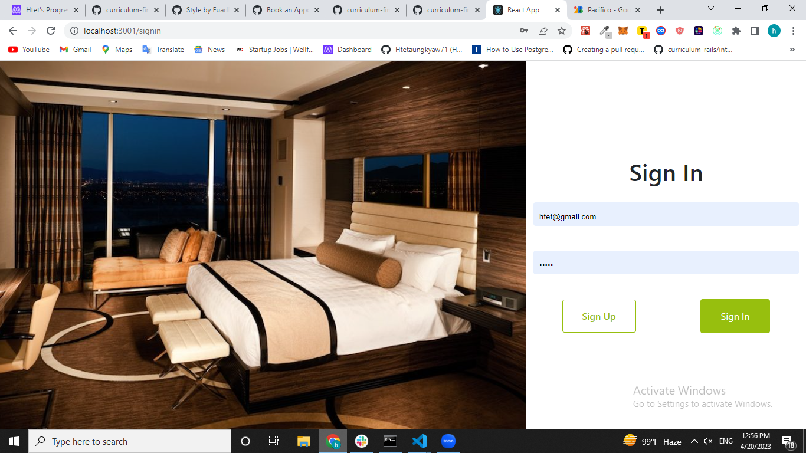

<a name="readme-top"></a>

# 📗 Table of Contents

- [📖 About the Project](#about-project)
  - [🛠 Built With](#built-with)
    - [Tech Stack](#tech-stack)
    - [Key Features](#key-features)
  - [ Kanban Board](#kanban-board)
  - [ React Frontend](#react-frontend)
  - [ API Documentation](#api-docs)
  - [🚀 Live Demo](#live-demo)
  
- [💻 Getting Started](#getting-started)
  - [Setup](#setup)
  - [Prerequisites](#prerequisites)
  - [Install](#install)
  - [Usage](#usage)
  - [Run tests](#run-tests)
  - [Deployment](#triangular_flag_on_post-deployment)
- [👥 Authors](#authors)
- [🔭 Future Features](#future-features)
- [🤝 Contributing](#contributing)
- [⭐️ Show your support](#support)
- [🙏 Acknowledgements](#acknowledgements)
- [❓ FAQ](#faq)
- [📝 License](#license)

<!-- PROJECT DESCRIPTION -->

# 📖 Pinecone Place <a name="about-project"></a>


**Pinecone Place** is a luxury room booking application where the user can register new accounts, login and reserve appointsments for booking rooms. It is built and connected by using two different apps both in different repos.One repo take care of the back-end side of the application built with Ruby on Rails and PostgreSQL. The second repo takes care of the front-end which was built with JavaScript React-Redux.




### Kanban Board 🖧
- [Kanban Board](https://github.com/Ibnballo1/book_appointment_backend/projects/1)


##  API Documentation<a name="api-docs"></a>

- Here is the API documentation of the project [Pinecone Place API-Docs](http://127.0.0.1:3000/api-docs/index.html)


## 🛠 Built With <a name="built-with"></a>

### Tech Stack <a name="tech-stack"></a>

<details>
  <summary>Client</summary>
  <ul>
    <li><a href="https://reactjs.org/">React.js</a></li>
  </ul>
</details>

<details>
  <summary>Server</summary>
  <ul>
    <li>Rails</li>
  </ul>
</details>

<details>
<summary>Database</summary>
  <ul>
    <li><a href="https://www.postgresql.org/">PostgreSQL</a></li>
  </ul>
</details>

### Key Features <a name="key-features"></a>

- **[Rooms List endpoint]**
- **[Devise authentication to access Reservations]**
- **[Authenticated Users can add/mark as removed a room]**
- **[Authenticated Users can reserve/remove a room]**

##  API Documentation<a name="api-docs"></a>

- Here is the API documentation of the project [book-appointment API-Docs]()


<p align="right">(<a href="#readme-top">back to top</a>)</p>

<!-- React Frontend -->
##  React Frontend <a name="react-frontend"></a>
- Here is the Frontend part of the project [book appointment app](https://github.com/Ibnballo1/book_appointment_frontend.git)

## 🚀 Live Demo <a name="live-demo"></a>

- [Live Demo :rocket:]() :smiley:

<p align="right">(<a href="#readme-top">back to top</a>)</p>

<!-- GETTING STARTED -->
## 💻 Getting Started <a name="getting-started"></a>

To get a local copy up and running, follow these steps.
### Prerequisites

To run this project you need:
`Git` and `Ruby`
```
 gem install rails
```

### Install

Install this project with:

```sh
  bundle install
```
- Generate a secret key using `rails secret`
- Create a  `.env` file with the following content:
```
POSTGRES_USER=postgres
# If you declared a password when creating the database:
POSTGRES_PASSWORD=YourPassword
POSTGRES_HOST=localhost
POSTGRES_DB=Hello_Rails_Backend_development
POSTGRES_TEST_DB=Hello_Rails_Backend_test
# Devise secret key
DEVISE_JWT_SECRET_KEY=Secret Key you generated
```

Create a Database (Mandatory)

```
rails db:create
```

If you have made a migration then run this command

```
rails db:migrate
```
```
rails db:seed
```
### Usage

To run the project, execute the following command:

```sh
   rails s -p 3001 # # for serving the API on localhost:3001
```

Run tests
```
bundle exec rspec
```

<p align="right">(<a href="#readme-top">back to top</a>)</p>

<!-- AUTHORS -->

## 👥 Authors (5 Micronauts) <a name="authors"></a>

👤 **Jorge**

- GitHub: [@githubhandle](https://github.com/jorgegoco)
- Twitter: [@twitterhandle](https://twitter.com/JorgeGo78017548)
- LinkedIn: [LinkedIn](https://www.linkedin.com/in/jorgegoco/)

👤 **Abdullateef Bello**

- GitHub: [@githubhandle](https://github.com/Ibnballo1)
- Twitter: [@twitterhandle](https://twitter.com/webprotekh)
- LinkedIn: [LinkedIn](https://linkedin.com/in/abdullateef_bello)

👤 **Htetaungkyaw**

- GitHub: [@githubhandle](https://github.com/Htetaungkyaw71/)
- Linkedin: [@linkedinhandle](https://www.linkedin.com/in/htetakyaw/)
- Twitter: [@twitterhandle](https://twitter.com/Htetaungkyaw172)

👤 **Petro Loltolo Lesapiti**

- GitHub: [@petrolesapiti](https://github.com/Loltolo-Lesapiti)
- LinkedIn: [@petrolesapiti](https://www.linkedin.com/in/petrolesapitiloltolo/)

👤 **Fuad Nabiyev**

- GitHub: [@githubhandle](https://github.com/FuadNabi)
- Twitter: [@twitterhandle](https://twitter.com/FuadNebiyev2)
- LinkedIn: [LinkedIn](https://www.linkedin.com/in/fuad-nabiyev/)

<p align="right">(<a href="#readme-top">back to top</a>)</p>

<!-- FUTURE FEATURES -->

## 🔭 Future Features <a name="future-features"></a>

- [ ] **[Admin Roles and access to add new rental rooms]**
- [ ] **[Keep count of the rooms using addtional attribute]**

<p align="right">(<a href="#readme-top">back to top</a>)</p>

<!-- CONTRIBUTING -->

## 🤝 Contributing <a name="contributing"></a>

Contributions, issues, and feature requests are welcome!

Feel free to check the [issues page](../../issues/).

<p align="right">(<a href="#readme-top">back to top</a>)</p>

<!-- SUPPORT -->

## ⭐️ Show your support <a name="support"></a>

Give a ⭐️ if you like this project!

<p align="right">(<a href="#readme-top">back to top</a>)</p>

<!-- ACKNOWLEDGEMENTS -->

## 🙏 Acknowledgments <a name="acknowledgements"></a>

I would like to thank:
- [Microverse](https://www.microverse.org/)
- Code Reviewers


<p align="right">(<a href="#readme-top">back to top</a>)</p>

<!-- FAQ (optional) -->

## ❓ FAQ <a name="faq"></a>

- **How I can install rails?**

  - You can follow the [official guide](https://guides.rubyonrails.org/getting_started.html#installing-rails) to install rails. If you have gem installed, you can run `gem install rails` to install rails.

- **How I can run this project?**

  - After cloning the repository, run `bundle` and then run `rails s` with option argument `-p 3001`. This will run the server on `localhost:3001`. You can change the port number if you want. Then you can use any API client to test the endpoints. For example, you can use [Postman](https://www.postman.com/) or [Insomnia](https://insomnia.rest/). You can also use the [API Documentation](https://eldorado.onrender.com/api-docs/) to test the endpoints. 

- **How I can run tests?**
  
    - After cloning the repository, run `bundle` and then run `rspec` to run the tests. 
<p align="right">(<a href="#readme-top">back to top</a>)</p>

<!-- LICENSE -->

## 📝 License <a name="license"></a>

This project is [MIT](./MIT.md) licensed.

<p align="right">(<a href="#readme-top">back to top</a>)</p>
